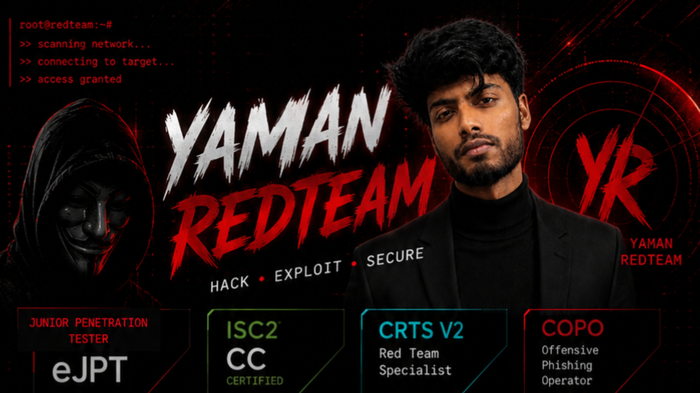
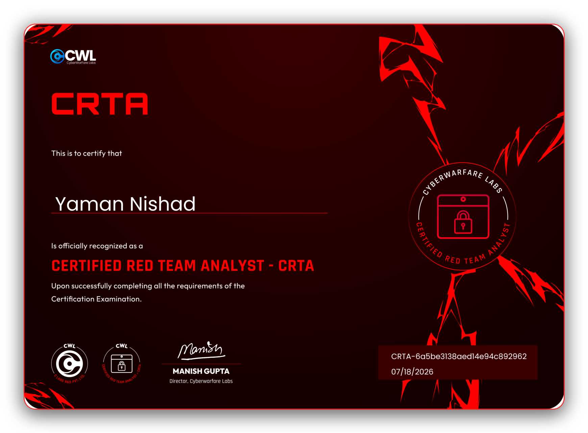
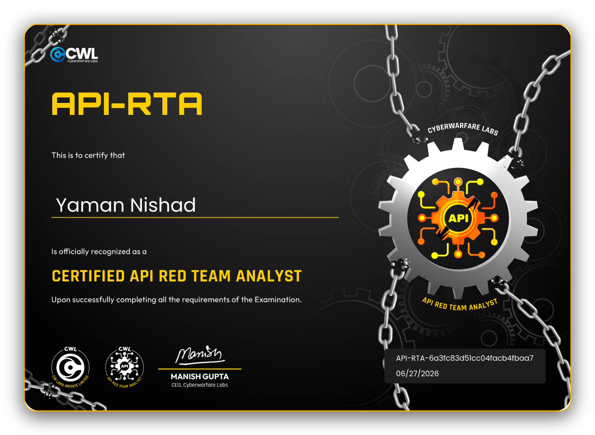
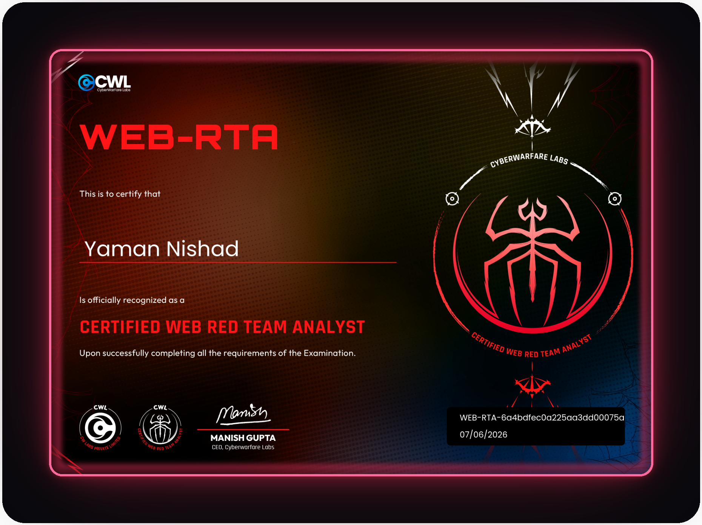
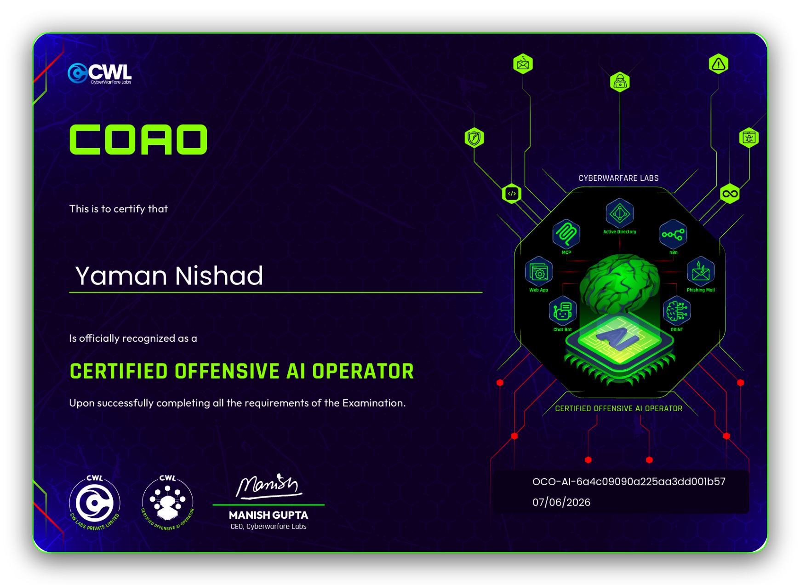
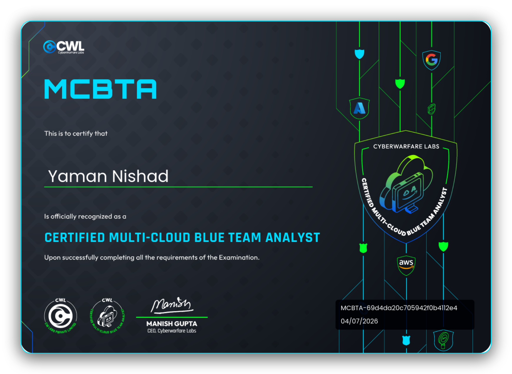

<!-- Profile README for github.com/Yaman-RedTeam — Red/Black Theme -->

<div align="center">




[](https://yaman-redteam.netlify.app)
[](https://www.linkedin.com/in/yaman-redteam/)
[](https://www.youtube.com/@YamanRedTeam)
[](https://www.instagram.com/yaman.redteam)
[](https://tryhackme.com/p/YamanRedTeam)


<a href="https://yaman-redteam.netlify.app">
  
</a>

<br/>

[`🏠 About`](#rootyaman-redteam-cat-aboutmd) · [`🧰 Arsenal`](#-cybersecurity-arsenal) · [`📊 Stats`](#-statsexe-) · [`🎯 Featured Ops`](#-featured_ops-) · [`📜 Certifications`](#-certificationslog-)

</div>

---

## `root@yaman-redteam:~#` cat about.md

```ini
[identity]
name        = Yaman Nishad
role        = Red Team Operator | AI Offensive Security
location    = India
education   = MCA (Cybersecurity) - Amity University

[certifications]
verified    = 5   # see CERTIFICATIONS.log section below

[current_focus]
>> AI-Assisted Red Team Operations
>> Web & API Penetration Testing
>> Active Directory Attack Simulation
>> Advanced Reconnaissance & OSINT
>> Adversary Emulation & Offensive Automation

[currently_building]
project      = Yaman-RedTeam/Portfolio
description  = Cyberpunk-themed portfolio — live certs, projects, YouTube feed & red team writeups
live         = https://yaman-redteam.netlify.app

[objective]
transition_to -> "Dedicated Red Team Operator specializing in AI-driven offensive security, adversary emulation, Active Directory operations, web exploitation, and advanced attack simulation"
```

> *"I don't just secure systems — I exploit them to understand the attacker's methodology, then neutralize the threat before it acts."*

---

## 🧰 Cybersecurity Arsenal

<h4>🛠 Exploitation</h4>

                     

<h4>🌐 Web Application Security</h4>

              

<h4>🔎 Recon & OSINT</h4>

            

<h4>🧩 Active Directory</h4>

            

<h4>🛡 Vulnerability Assessment</h4>

   

<h4>🎣 Phishing & Social Engineering</h4>

  

<h4>📊 Detection & Monitoring</h4>

        

<h4>💻 Operating Systems</h4>

    

<h4>☁ Cloud & Infrastructure</h4>

    

<h4>🤖 AI Offensive Operations</h4>

             

---

## `[ STATS.exe ]`

<div align="center">


</div>

---

## `[ FEATURED_OPS ]`

<div align="center">

| Repository | Highlights |
|:---|:---|
| [**`VAPT-Full-Working-Project`**](https://github.com/Yaman-RedTeam/Vapt-Full-Working-Project) | Complete enterprise VAPT lab covering exploitation, Active Directory, detection engineering, Splunk, phishing simulations and reporting. |
| [**`Yaman-eJPT-Training`**](https://github.com/Yaman-RedTeam/Yaman-eJpt-Training) | eJPT preparation notes, methodology, privilege escalation, Active Directory labs and walkthroughs. |
| [**`Local-LLM-Setup`**](https://github.com/Yaman-RedTeam/Local-LLM-Setup) | Local AI infrastructure for offensive security, MCP workflows, AI agents and cybersecurity research. |

</div>

---

## `[ CERTIFICATIONS.log ]`

<div align="center">

### `> Verified Professional Certifications`

<table>
<tr>

<td align="center" width="33%">
<a href="assets/certs/raw/crta.png" title="Click to view full-resolution certificate">

</a>
<br/>
<b>CRTA</b> — Certified Red Team Analyst
<br/><sub>Red team operations, adversary emulation &amp; C2 tradecraft</sub>
<br/><sub>Issued 07/18/2026 · CyberWarfare Labs</sub>
<br/><sub>ID: <code>CRTA-6a5be3138aed14e94c892962</code></sub>
</td>

<td align="center" width="33%">
<a href="assets/certs/raw/api-rta.png" title="Click to view full-resolution certificate">

</a>
<br/>
<b>API-RTA</b> — Certified API Red Team Analyst
<br/><sub>API exploitation, auth bypass &amp; business-logic attacks</sub>
<br/><sub>Issued 06/27/2026 · CyberWarfare Labs</sub>
<br/><sub>ID: <code>API-RTA-6a3fc83d51cc04facb4fbaa7</code></sub>
</td>

<td align="center" width="33%">
<a href="assets/certs/raw/web-rta.png" title="Click to view full-resolution certificate">

</a>
<br/>
<b>WEB-RTA</b> — Certified Web Red Team Analyst
<br/><sub>Web application exploitation &amp; advanced attack chains</sub>
<br/><sub>Issued 07/06/2026 · CyberWarfare Labs</sub>
<br/><sub>ID: <code>WEB-RTA-6a4bdfec0a225aa3dd00075a</code></sub>
</td>

</tr>
<tr>

<td align="center" width="33%">
<a href="assets/certs/raw/oco-ai.png" title="Click to view full-resolution certificate">

</a>
<br/>
<b>OCO-AI</b> — Certified Offensive AI Operator
<br/><sub>AI-driven offensive operations &amp; LLM / agent red teaming</sub>
<br/><sub>Issued 07/06/2026 · CyberWarfare Labs</sub>
<br/><sub>ID: <code>OCO-AI-6a4c09090a225aa3dd001b57</code></sub>
</td>

<td align="center" width="33%">
<a href="assets/certs/raw/mcbta.png" title="Click to view full-resolution certificate">

</a>
<br/>
<b>MCBTA</b> — Certified Multi-Cloud Blue Team Analyst
<br/><sub>Multi-cloud detection engineering across AWS, Azure &amp; GCP</sub>
<br/><sub>Issued 04/07/2026 · CyberWarfare Labs</sub>
<br/><sub>ID: <code>MCBTA-69d4da20c705942f0b4112e4</code></sub>
</td>

<td width="33%"></td>

</tr>
</table>

<sub>Click any card to open the full-resolution certificate.</sub>

</div>

---

<div align="center">

### `> Building • Breaking • Defending`

**Offensive Security • Red Teaming • AI Offensive Operations • Web Security • Active Directory**

<sub>30K+ cybersecurity community · YouTube research channel · Top 1% TryHackMe</sub>


</div>
